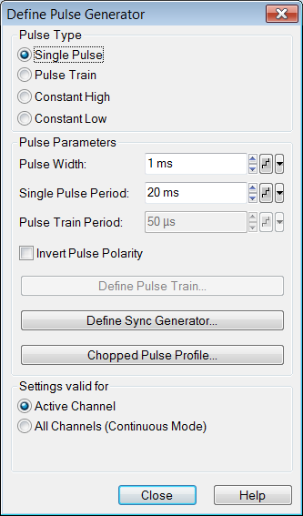
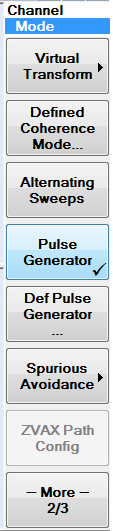
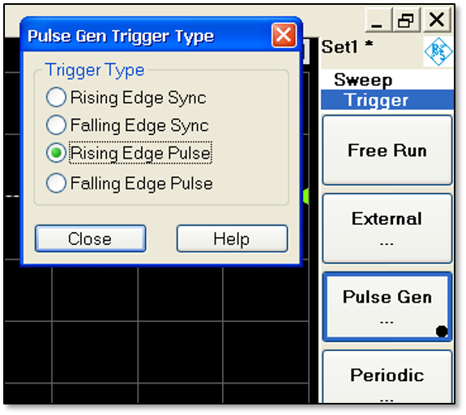
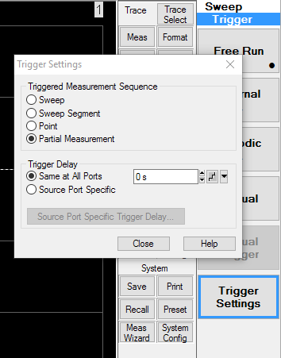
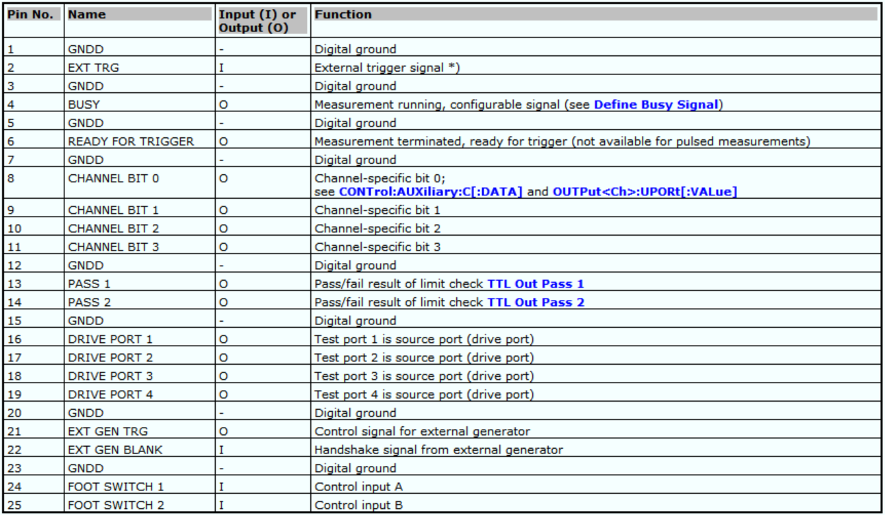
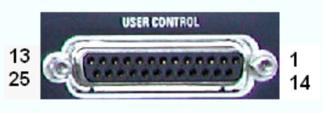
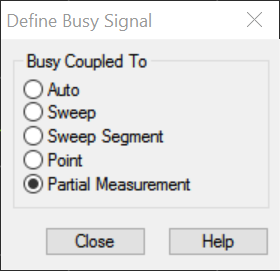
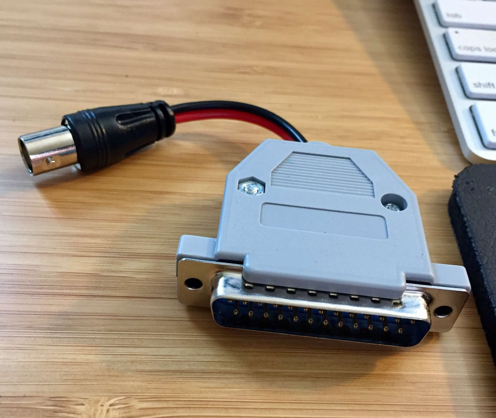
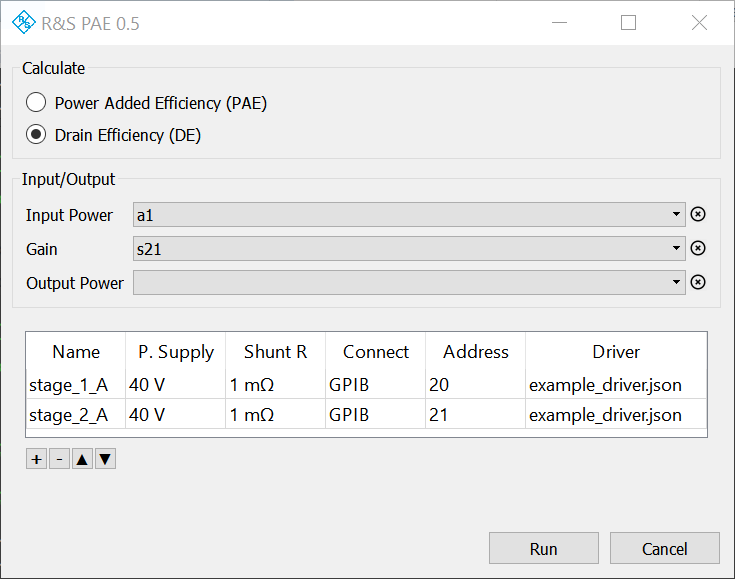
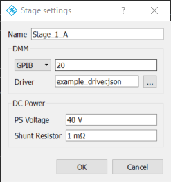

R&S Power Added Efficiency (PAE)
================================

This application coordinates a measurement on a R&S Vector Network Analyzer with one or more external Digital Multimeters to calculate Power Added Efficiency or Drain Efficiency.

Requirements
------------

This application has been validated with the following setup. All instructions that follow will assume the use of this setup.

- R&S ZVA Vector Network Analyzer (VNA)
- ZVA-K7 Pulsed Measurements option\*
- VISA installer
- Custom DB25 to BNC adapter
- Digital Multimeter (DMM)

\*The `ZVA-K7` option is used to coordinate timing between the VNA and DMM(s); pulsed RF itself is not required for this setup to work. If your part and measurement do not require pulsed RF, there is no need to physically set up for it.

Other VNAs and setups may work, but have not been tested.

Installation
------------

Copy the installer (`.msi` file) onto the ZVA and execute it. Follow the on-screen instructions.

Measurement Setup
-----------------

In addition to the usual measurement settings (start frequency, stop frequency, points, IF BW, etc), the following must also be set up. The goal of this section is to define and control the timing of each source and frequency point combination measured by the ZVA, and to set up an output that we can use to trigger the DMM correctly.

### Setup Pulse Generator

These instructions require ZVA option `ZVA-K7`: Pulsed Measurements. These settings can be used to control the timing of the actions of the ZVA during measurement, and to coordinate those actions with an external device (such as the DMM(s)).

The `Pulse Generator` settings can be found by performing the following:

`Mode (hard key) => -- More -- (soft key) => Def Pulse Generator... (soft key)`

Under `Pulse Type`, select `Single Pulse`. Then, enter an appropriate `Pulse Width` and `Single Pulse Period`. The pulse width should be long enough for the part to settle and the DMM to "capture" a point (i.e. Integration Time). The pulse period should be long enough that the DMM is ready to capture the next point. Note that the pulse period for most DMMs needs to be significantly longer than the integration time, and that this point-to-point "turnaround time" is not listed in manufacturer datasheets as far as I can tell.

Accept these settings. Then, back on the soft key menu, make sure `Pulse Generator` is checked (enabled). If not, press the `Pulse Generator` soft key to enable it.

Note: `Pulse Train` could work, but it has not been tested.

### Setup Trigger

Next we need to set up the trigger to use the internal pulse generator.

Navigate to:

`Sweep (hard key) => Trigger (soft key) => Pulse Gen... (soft key)`

In the `Pulse Gen Trigger Type` window, select `Rising Edge Pulse`.

Now that we are triggering on the pulse generator, we need to also tell the VNA to only measure one frequency point with one source on each trigger, so we can coordinate with the DMM.

Navigate to:

`Sweep (hard key) => Trigger (soft key) => Trigger Settings (soft key)`

In the trigger settings window, under `Triggered Measurement Sequence`, select `Partial Measurement`.

### Setup User Control Output

The ZVA has a `USER CONTROL` DB25 connector on the back with a range of configurable inputs and outputs.

We want to use one output in particular, `Busy Signal` on pin 4, to indicate when each point-measurement occurs. We will use this signal to trigger the DMM(s).

To configure user control, navigate to:

`Sweep (hard key) => -- More -- (soft key) => Define Busy Signal... (soft key)`

In the `Define Busy Signal` dialog, select `Partial Measurement`.

### Connect User Control to DMM(s)

Now that we have the busy signal coming out of pin 4 of the user control connector, we need to connect that signal to our DMM(s).

To do this, we will need a custom DB25 to BNC adapter (or similar). We want to use pins 4 (busy) and 3 (ground) of the DB25 connector as the signal and ground, respectively, of the BNC connector.

If more than one DMM is being used, the BNC connector can be split with a tee. I have not tested to see how many DMMs can be triggered off the unbuffered user control output; a buffer might be necessary if too many DMMs are connected.

DMM Control
-----------

The PAE utility will be controlling the DMMs via VISA and SCPI.

### Connection method

You can connect each DMM by either ethernet or GPIB.

If using ethernet, you will need to make sure the ZVA can communicate with each DMM and note their IP address.

Some ZVAs come with a GPIB connector on the back. Unfortunately this connector is in "client mode", meaning that it cannot be used to control another instrument. To use GPIB control, you will need a USB to GPIB adapter such as the one made by National Instruments.

### VISA

You will need to install VISA on-instrument.

If using a USB to GPIB adapter, use the version of VISA that comes with the driver for that adapter. If not using one, you can use R&S VISA for Windows. R&S VISA for a range of platforms can be downloaded from:

[R&S VISA](https://www.rohde-schwarz.com/us/applications/r-s-visa-application-note_56280-148812.html)  
[https://www.rohde-schwarz.com/us/applications/r-s-visa-application-note_56280-148812.html](https://www.rohde-schwarz.com/us/applications/r-s-visa-application-note_56280-148812.html)

### JSON Driver

JSON (text) driver files provide information on controlling each DMM. Driver files for controlling Agilent/Keysight 344xx-series DMMs are provided.

For any other DMM type, you will need to create a driver yourself. The driver format is mostly self-explanatory. It is best to use one of the existing drivers as a starting point, then modify it for your specific DMM.

Each driver contains the following sections:

#### "driver version"

Current version is "1.0.0"

#### "setup scpi"

A list of commands to be sent to the DMM as-is at the beginning of each measurement. An example setup routine (described in English as opposed to SCPI) may be as follows:

- Preset
- Clear previous errors
- Set integration time / precision
- Set voltage range
- Set trigger source to external
- Set trigger delay (setting) time
- Set trigger slope
- Set sampling mode (immediate, one point)
- Set data type to ASCII

Note: Setting the settling time as a hardcoded value in the scpi setup section is non-ideal. This might change in the future.

#### "set points scpi"

The SCPI command to set the number of (triggered) points the DMM should expect to accummulate. The `%1` placeholder will be replaced by the number of points before the command is sent.

#### "start scpi"

The command that signals to the DMM that the measurement is about to start. This SCPI command is usually `INIT` on most DMMs.

#### "sleep after start scpi"

The amount of time the application should wait before expecting the DMM to be ready for the first measurement. This is necessary because many DMMs become unresponsive after the `INIT` command is sent.

#### "data format"

For now, only "ASCII" is possible. In the future binary data formats may be supported.

#### "query data scpi"

The command used to query the data/results from the DMM after measurement.

This is usually `FETCh?`.

#### "measurement type"

Right now only "voltage" is supported. In the future "current" measurements may be supported as well.

Using the Application
---------------------

The PAE utilty can be started from the External Tools menu on the ZVA.

Navigate to:

`System Config (hard key) => -- More -- (soft key) => External Tools (soft key) => PAE.lnk`

the utility should start.

The utility has the following sections:

### Calculate

Choose whether you want the results calculated as PAE or DE

### Input/Output

Choose the appropriate traces from your measurement setup that correspond to input power, gain, and/or output power. Which traces are required will depend on your calculation type.

The traces must exist in the same channel. This is required because of DMM timing.

### Amplifier Stages

The table at the bottom contains a list of amplifier stages, and information about the DMM and DC measurement setup for each stage.

Double-clicking on the row for a stage brings up the stage settings dialog.

Each definition includes the following sections:

- Name
- Power supply voltage
- Shunt resistor value
- Connection method (GPIB, TCPIP)
- Address (e.g. 20 or 192.168.1.2)
- Driver file

### Run

Click the `Run` button to start the measurement.

If there is a problem with the application settings, an error message is displayed on the bottom of the window.

Otherwise the measurement begins. After it is complete, the following memory traces should appear on the ZVA for each stage/DMM:

- Current for that stage, in Amps
- PAE/DE calculation as a decimal value from 0-1

These traces are initially created in a new window, but they can be moved to a different diagram and manipulated as desired. Subsequent runs of the application will update these traces without losing the user customizations.
